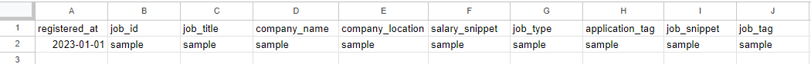

# 環境構築および実行手順について

## 目次

1. [Googleドライバーのセットアップ](#google-driver-setup)
2. [Google Spread Sheetへ書き込むためのAPI設定](#google-spread-sheet-setup)
3. [Python環境構築](#python-setup)

---

<a id='google-driver-setup'></a>
## 1. Googleドライバーのセットアップ

### Google Chrome Driverのインストール

1. まず、Google Chromeのバージョンを確認してください。  
    * Chromeを開き、右上の`⋮` > `ヘルプ` > `Google Chromeについて`で確認できます。
2. [ChromeDriverの公式ページ](https://sites.google.com/a/chromium.org/chromedriver/downloads)から、自分のGoogle Chromeのバージョンに対応するドライバーをダウンロードしてください。
3. ダウンロードしたZIPファイルを解凍し、`chromedriver.exe`を適当な場所に保存してください。
4. `chromedriver.exe`のパスを環境変数に追加するか、プログラム内でそのパスを指定してください。

---

<a id='google-spread-sheet-setup'></a>
## 2. Google Spread Sheetへ書き込むためのAPI設定

### Google API Consoleでプロジェクトを作成

1. [Google API Console](https://console.developers.google.com/)にアクセスして、新しいプロジェクトを作成します。
2. 左のメニューから`ライブラリ`を選択し、`Google Sheets API`と`Google Drive API`を有効にします。

### サービスアカウントの作成とJSONキーファイルのダウンロード

1. Google API Consoleの`認証情報`タブに移動します。
2. `サービスアカウント`を作成し、JSONキーファイルをダウンロードします。
3. ダウンロードしたJSONファイルを任意のディレクトリに保存してください。

### Google Spread Sheetの設定

1. 作成または使用するGoogle Spread Sheetを開きます。
2. サービスアカウントのメールアドレス（JSONキーファイル内に記載）をSpread Sheetの共有設定に追加し、編集権限を付与します。
3. カラム名とsample行を記載します。（sample行がないとエラーになるため必須です）

| registered_at | job_id | job_title | company_name | company_location | salary_snippet | job_type | application_tag | job_snippet | job_tag |
| ------------- | ------ | --------- | ------------ | ---------------- | -------------- | -------- | --------------- | ----------- | ------- |
| 2023-01-01    | sample | sample    | sample       | sample           | sample         | sample   | sample          | sample      | sample  |



### 環境変数の設定

次のように環境変数を設定してください。

| 変数               | 値                                                                                |
| ------------------ | --------------------------------------------------------------------------------- |
| ST_CREDENTIAL_FILE | ダウンロードしたJSONファイルのフルパス                                            |
| ST_SPREADSHEET_KEY | Spread Sheetの識別子(URLのhttps://docs.google.com/spreadsheets/d/{この部分}/edit) |


以上で環境構築は完了です。プログラムを実行して、データをGoogle Spread Sheetに書き込むことができます。

<a id='python-setup'></a>
## 3. Python環境構築

### Pythonのインストール

1. [Python公式サイト](https://www.python.org/downloads/windows/)からPython 3.10.6をダウンロードし、インストールしてください。
2. インストール後、コマンドプロンプトで `python --version` と入力して、インストールが成功したか確認してください。

### 依存ライブラリのインストール

プロジェクトディレクトリ内にある `requirements.txt` ファイルを用いて、必要なパッケージをインストールします。

```
pip install -r requirements.txt
```

---

### プログラムの実行

プロジェクトディレクトリ内にある`scraping_tool.py`を起動します。

```
python scraping_tool.py
```

